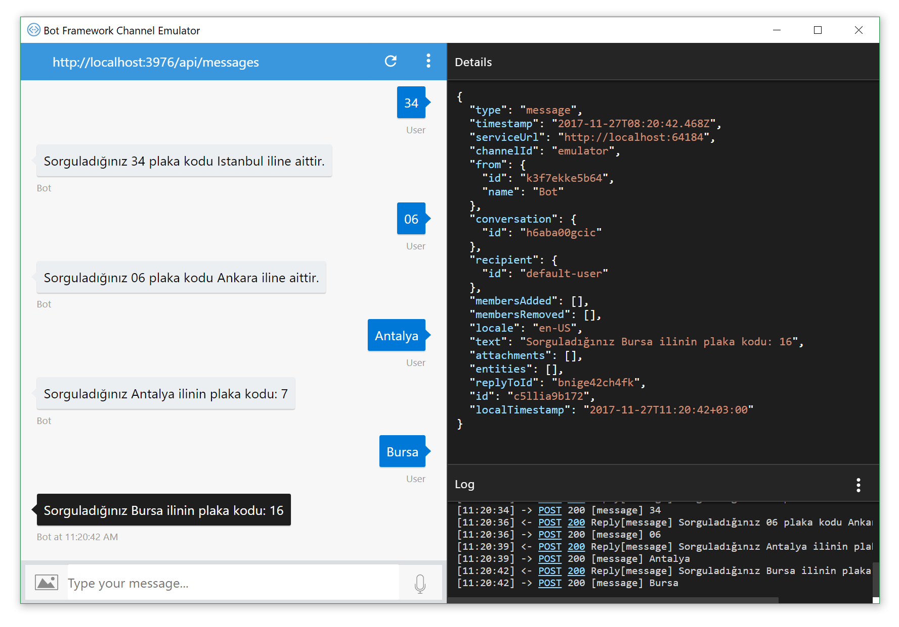

# Şehir-Plaka Kodu Arama
[Microsoft Bot Framework](https://dev.botframework.com), Chat Bot (Dijital Asistan) uygulamaları geliştirmek için sunulan ve sizlerin pek çok kanala aynı anda tek bir kod yapısı ile bot uygulaması geliştirmenizi sağlayan bir framework'tür.

Bu uygulamada basit olarak Bot uygulamasının temelini anlamak için plaka kodundan, şehir ismini bulabileceğiniz bu örnek üzerinden inceleyeceğiz.

Burada cümle değil komut bazlı çalışacağı için, klasik console uygulamalarından çok da bir farklı olmayan şekilde çalışacaktır.

## Kod'u inceleme
MessagesController.cs içerisinde Post methodu'nun altındaki kod yapımız aşağıdaki gibi olacaktır. 
```csharp
  //Bu kod parçası sadece komut-cevap olarak çalışır
            if (activity.Type == ActivityTypes.Message)
            {
                ConnectorClient connector = new ConnectorClient(new Uri(activity.ServiceUrl));
                City cm = new City();

                //Girilen içerik sadece sayı ise Plaka kodu olduğunu anlayarak, şehir adını arıyor.
                if (activity.Text.All(char.IsDigit))
                {
                    string cityName = cm.getCityNamebyPlateNumber(Convert.ToInt32(activity.Text));

                    string message = $"Sorguladığınız {activity.Text} plaka kodu {cityName} iline aittir.";
                    if (cityName == null) message = $"Sorguladığınız {activity.Text} sorgu kayıtlarımızda bulunamadı";
                    Activity reply = activity.CreateReply(message);
                    await connector.Conversations.ReplyToActivityAsync(reply);
                }
                else
                {
                    //Girilen içerik sadece yazı ise Şehir adı olduğunu varsayarak, plaka kodunu arıyor.
                    int pNumber = cm.getPlateNumberbyCity(activity.Text);

                    string message = $"Sorguladığınız {activity.Text}  ilinin plaka kodu: {pNumber}";
                    if (pNumber == 0) message = $"Sorguladığınız {activity.Text} sorgu kayıtlarımızda  bulunamadı";
                    Activity reply = activity.CreateReply(message);
                    await connector.Conversations.ReplyToActivityAsync(reply);
                }
            }
            else
            {
                HandleSystemMessage(activity);
            }
            var response = Request.CreateResponse(HttpStatusCode.OK);
            return response;
```

## Kod'un emülatör üzerinde çalışması
